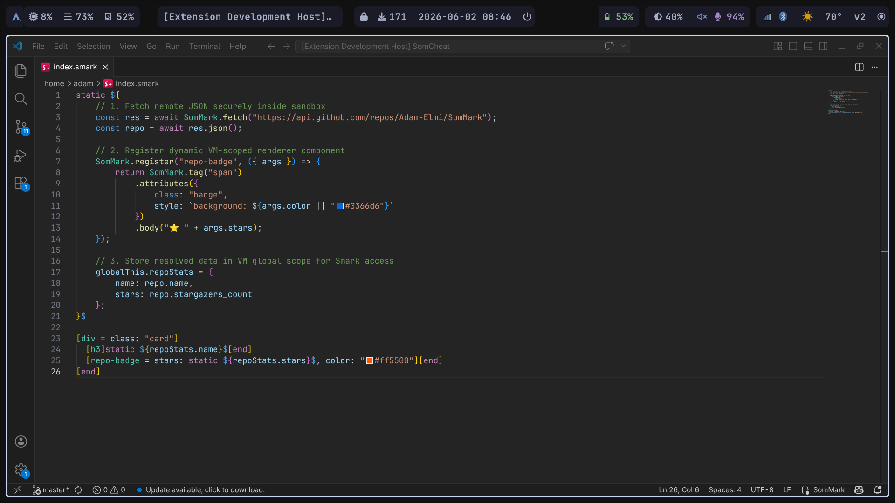
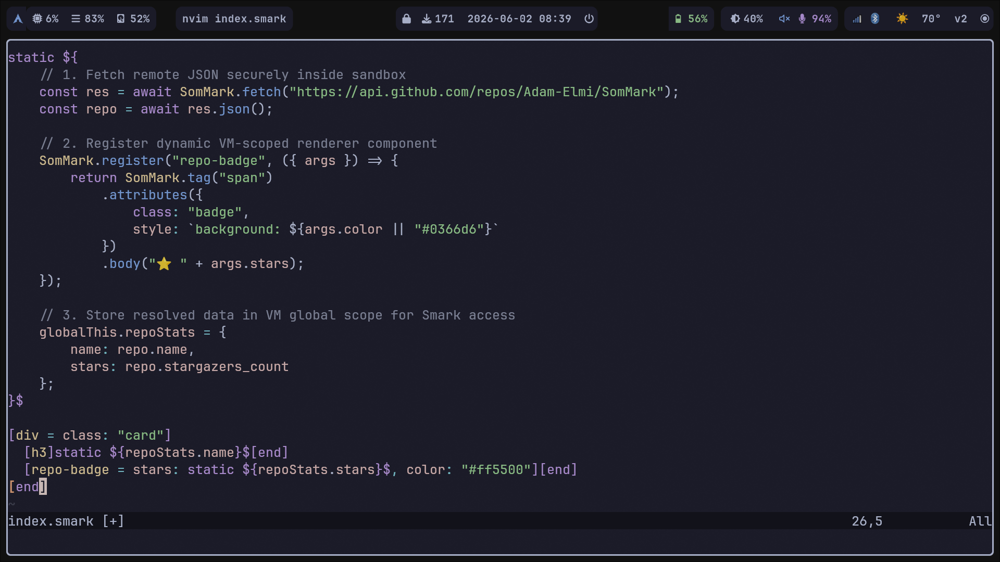
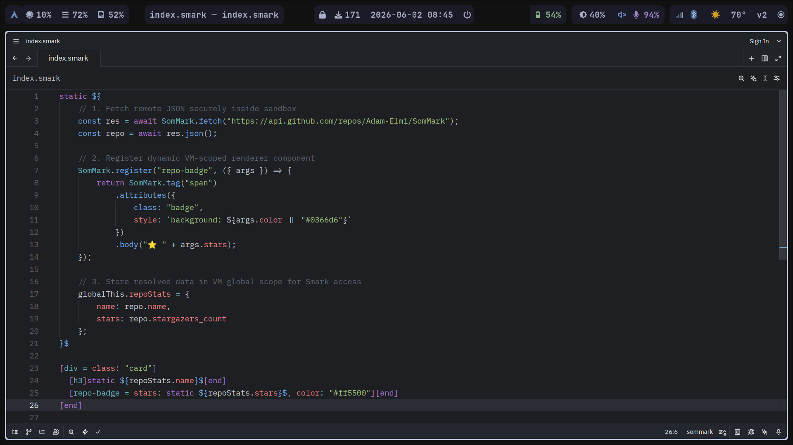

# SomMark-LSP 

A high-performance Language Server Protocol (LSP) implementation designed specifically for the **SomMark** markup language. It brings modern IDE capabilities, precise diagnostics, and rich semantic highlighting to your favorite editors.

---

## Key Features

- **Real-time Diagnostics**: Delivers accurate syntax error reporting with exact line and character ranges.
- **Semantic Tokens**: Provides high-fidelity, token-based coloring in editors supporting LSP semantic tokens.
- **Zero-Config Global Install**: Simple global registration lets you spin up the server in any directory instantly.

---

## Installation

Install the SomMark Language Server globally via `npm`:

```bash
npm install -g sommark-lsp
```

This registers the `sommark-lsp` command on your system path.

---

## Supported Editors

Click on the guides below to set up **SomMark-LSP** in your preferred editor.

### [VS Code](editors/vscode/README.md)
*Seamless integration with native auto-closing pairs and premium syntax coloring.*



---

### [Neovim](editors/neovim/README.md)
*Configuration snippet for `nvim-lspconfig` including dynamic, conflict-free auto-closing pairs.*



---

### [Vim](editors/vim/README.md)
*Integrated with `coc.nvim` and dynamic expression-based auto-closing keys.*


---

### [Zed](editors/zed-sommark/README.md)
*Native WebAssembly-based extension for the ultra-fast Zed editor.*



---

## Configuration

You can configure LSP diagnostics and behavior by adding a `smark.config.js` file to your project root.
