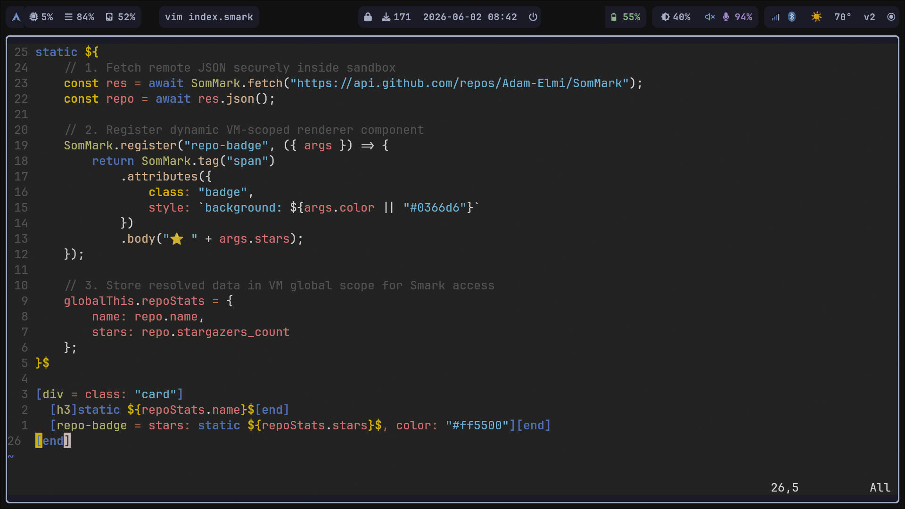

# SomMark Support for Vim (via coc.nvim)

This directory contains the minimal setup required to add full SomMark Language Server support to Vim using the **coc.nvim** plugin.



## Prerequisites

You must have [coc.nvim](https://github.com/neoclide/coc.nvim) installed in your Vim environment.

## 1. Setup Filetype Detection
Vim needs to know that `.smark` files belong to the `sommark` language.

Add the following line directly to your `~/.vimrc` file:
```vim
autocmd BufRead,BufNewFile *.smark set filetype=sommark
```

## 2. Configure the Language Server
You need to tell `coc.nvim` how to launch the SomMark LSP when you open a `.smark` file.

1. Open Vim and run the command `:CocConfig` to open your global `coc-settings.json` file.
2. Add the `sommark-lsp` block to your `"languageserver"` section so that it looks like this:

```json
{
  "languageserver": {
    "sommark-lsp": {
      "command": "sommark-lsp",
      "args": ["--stdio"],
      "filetypes": ["sommark", "smark"],
      "rootPatterns": ["smark.config.js", "package.json", ".git"]
    }
  }
}
```

That's it! Restart Vim and open any `.smark` file to see real-time diagnostics and syntax highlighting.
